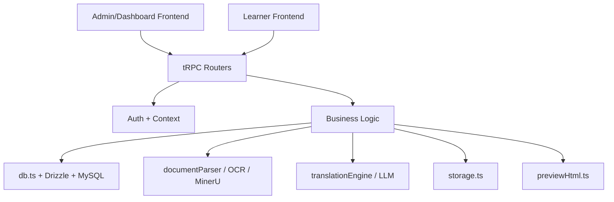

# OME Translate 项目交接说明

## 1. 项目一句话概括

这是一个面向企业培训内容本地化的全栈 TypeScript 系统：管理员上传中文培训材料，服务端解析文档并生成分段内容，随后异步触发多语言翻译，学员端以中译对照的方式浏览内容，并可对翻译结果提交反馈。

当前项目不是“完全失控”的屎山，但已经出现了比较明显的结构性技术债，尤其体现在：

- 认证体系并存且边界不清
- 同一业务被复制成两套路由/后台流程
- 数据访问层过于集中
- 前端关键页面过大、状态和业务耦合严重

如果后续继续加功能而不做整理，维护成本会明显上升。

## 2. 技术栈与运行方式

### 前端

- React 19
- TypeScript
- Vite
- tRPC Client + React Query
- wouter
- Tailwind CSS + shadcn/ui 风格组件

入口：

- `client/src/main.tsx`
- `client/src/App.tsx`

### 后端

- Express
- tRPC
- TypeScript
- Drizzle ORM
- MySQL

入口：

- `server/_core/index.ts`
- `server/routers.ts`

### AI / 文档能力

- LLM 翻译/解释：封装在 `server/_core/llm/*` 与 `server/translationEngine.ts`
- 文档解析：`server/documentParser.ts`
- OCR：`server/ocr.ts`
- 外部复杂格式兜底解析：`server/mineruParser.ts`

### 存储

- 开发环境优先本地文件系统：`server/uploads`
- 配置 Forge/代理存储后走远端存储接口：`server/storage.ts`

## 3. 目录结构和职责

### `client/`

前端应用。

- `src/main.tsx`
  初始化 React Query、tRPC Client、全局错误监听。
- `src/App.tsx`
  路由注册中心，区分公开页面、学习页、dashboard 页。
- `src/pages/`
  页面级组件。
- `src/components/`
  布局、业务组件、UI 组件。
- `src/_core/hooks/useAuth.ts`
  OAuth/主站用户身份读取 Hook。

### `server/`

后端应用与业务实现。

- `_core/`
  基础设施层：启动、环境变量、tRPC、上下文、认证辅助、LLM provider。
- `routers/`
  tRPC 业务路由。
- `db.ts`
  几乎所有数据库读写都在这里。
- `documentParser.ts`
  文件解析总入口。
- `documentIr.ts`
  `segments` 与 `IR blocks` 的转换层。
- `translationEngine.ts`
  两段式翻译与 AI explain。
- `previewHtml.ts`
  翻译对照预览 HTML 生成。
- `storage.ts`
  本地/云端存储抽象。

### `shared/`

前后端共享常量、类型、辅助判断。

### `drizzle/`

数据库 schema。

## 4. 系统主架构

可以把系统分成 6 层：

1. Web UI 层
2. tRPC API 层
3. 认证/上下文层
4. 业务编排层
5. 数据/存储层
6. AI 与文档处理层

简化后的数据流如下：

## 5. 核心业务对象

### 5.1 documents

`documents` 表是整个系统最核心的实体。

虽然命名叫 `documents`，但实际承担了“课程/教程/培训材料”的职责。无论是后台课程管理还是前台学习页，底层基本都围绕它转。

主要字段含义：

- `title`：课程标题
- `originalFilename` / `fileType` / `s3Key` / `s3Url`：原文件信息
- `extractedText`：解析出的纯文本
- `segments`：结构化分段结果
- `status`：解析/翻译总状态
- `isPublished`：是否对学员可见
- `category` / `instructor` / `description` / `sortOrder`：课程元信息

### 5.2 translation_jobs

每个 `document` 对应多个目标语言翻译任务。

- 一个文档可有多个语言任务
- 状态流转：`pending -> processing -> completed / failed`
- `translatedSegments` 保存翻译后的分段
- `outputS3Url` 指向生成的双栏预览 HTML

### 5.3 glossary_entries

术语表，用中文术语对应英语基底，再扩展到西班牙语/泰语/印地语/越南语。

翻译引擎会把术语表注入 prompt，保证术语一致性。

### 5.4 feedbacks / user_progress / exercises

- `feedbacks`：学员对某段原文/译文的反馈
- `user_progress`：学员学习进度
- `exercises` / `exercise_attempts`：练习题和作答记录

## 6. 关键业务流程

### 6.1 课程/文档上传与翻译

入口主要有两套：

- `server/routers/documents.ts`
- `server/routers/courses.ts`

核心流程基本一致：

1. 前端上传文本或文件
2. 服务端保存原文件
3. `documentParser.ts` 解析内容
4. 解析结果转成 `segments`
5. 写入 `documents`
6. 为目标语言创建 `translation_jobs`
7. 直接在进程内调用 `triggerTranslation()`
8. 翻译成功后写回 `translatedSegments`
9. 生成 HTML 预览并存储
10. 更新文档/任务状态

这里有两个重要实现细节：

- 系统没有真正的异步任务队列，翻译是“伪异步”地在当前 Node 进程里自行触发的
- `segments` 是数据库持久化格式，`DocumentIR blocks` 是运行时展示/图片处理格式

### 6.2 文档解析

总入口：`server/documentParser.ts`

支持：

- PDF
- DOCX/DOC
- XLSX
- PPTX/PPT
- VSDX
- XMind
- 图片 OCR

策略是：

- 能本地解析就优先本地解析
- 失败后尝试 MinerU 兜底
- 解析后统一转成分段/IR

### 6.3 翻译引擎

核心文件：`server/translationEngine.ts`

翻译采用两段式：

1. 中文 -> 英文
2. 英文 -> 目标语言

目标是利用英语作为中间语，提升术语一致性和稳定性。

同时支持：

- glossary 注入
- 文本分块翻译
- Explain 功能

### 6.4 学员学习流程

前端关键页面：

- `client/src/pages/LearnPortal.tsx`
- `client/src/pages/LearnView.tsx`

流程：

1. 学员进入课程列表
2. 查看已发布内容
3. 选择目标语言
4. 进入三栏/双栏式学习页
5. 查看原文与译文对照
6. 对某段内容发起 AI explain
7. 提交翻译反馈
8. 记录学习进度

### 6.5 后台管理流程

当前实际上有两套后台概念：

- 旧的 `/admin/*`
- 新的 `/dashboard/*`

新 dashboard 现在更像主线，主要页面：

- `DashboardCourses.tsx`
- `DashboardFeedbacks.tsx`
- `DashboardGlossary.tsx`

负责：

- 建课/传课件
- 修改课程元信息
- 发布/下线课程
- 查看和处理用户反馈
- 管理术语表

## 7. 认证与权限现状

这是当前最需要让接手同事注意的地方之一。

### 7.1 实际上存在三套身份模型

#### A. Manus OAuth 主站用户

相关文件：

- `server/_core/sdk.ts`
- `server/_core/context.ts`
- `client/src/_core/hooks/useAuth.ts`

这是原始主站登录链路，`ctx.user` 主要从这里来。

#### B. 本地 JWT 用户认证

相关文件：

- `server/routers/authLocal.ts`
- `server/_core/context.ts`

这是 email/password + Bearer token 的本地用户体系。

#### C. Dashboard 独立管理员认证

相关文件：

- `server/_core/dashboardAuth.ts`
- `server/routers/dashboard.ts`

这是单独的 `dashboard_session` Cookie，不依赖前两套。

### 7.2 权限上的实际结果

- learner/public 流程主要依赖 `auth.me`
- dashboard 流程依赖 `dashboard.me`
- glossary 又做了一个“OAuth admin 或 dashboard admin 二选一”的混合鉴权
- OIDC 只留了 stub，还没真正接通

### 7.3 风险判断

这不是马上会炸的代码，但已经是明显的“分裂式演进”：

- 同一个系统里有多套认证真相
- `user.role === admin` 和 `dashboard admin` 不是同一个概念
- 新同事接手时最容易在“该走哪套身份”上绕晕

## 8. 前端架构现状

### 优点

- 页面分层总体还能看懂
- 组件库比较统一
- learner 与 dashboard 的 UI 路径已经基本分开

### 主要问题

#### 8.1 页面组件过大

几个代表性文件：

- `client/src/pages/dashboard/DashboardCourses.tsx`：约 705 行
- `client/src/pages/LearnView.tsx`：约 649 行

问题不是“行数大”本身，而是这些文件同时承担了：

- 数据查询
- 状态编排
- 异常处理
- 交互逻辑
- 大量 JSX 展示

这会让后续改动非常容易牵一发而动全身。

#### 8.2 旧后台页面仍然存在

`/admin/*` 老页面和组件并未彻底删掉，只是部分路由被重定向到 `/dashboard/*`。

这说明项目还处于迁移中间态，不是一个完全收口的架构。

#### 8.3 鉴权 Hook 与 dashboard 鉴权是两套

`useAuth()` 管的是主站/OAuth 用户；
`DashboardAdminLayout` 直接请求 `dashboard.me`。

从用户体验上没问题，但从架构上是双轨。

## 9. 后端架构现状

### 优点

- `server/_core` 基础设施层有一定分层意识
- tRPC 路由按照业务文件拆开了
- 文档解析、翻译、存储至少被抽成了独立模块

### 主要问题

#### 9.1 `server/db.ts` 过于集中

`server/db.ts` 约 648 行，承载了：

- 用户
- 管理员
- 文档
- 翻译任务
- 术语表
- 反馈
- 学习进度
- 练习题

这相当于一个“大仓储层”，短期查找方便，长期演进会变得难维护。

更具体地说：

- 领域边界不清
- 很难按业务做局部重构
- 单元测试和 mock 粒度不自然

#### 9.2 业务路由重复

最明显的一组：

- `server/routers/documents.ts`：约 233 行
- `server/routers/courses.ts`：约 269 行

两者都在做：

- 上传
- 解析
- 建 `document`
- 建 `translation job`
- 触发翻译
- 挂图片
- 重试翻译

这不是健康的“复用变体”，而是已经有重复实现了。

再一组：

- `server/routers/feedbacks.ts`
- `server/routers/dashboardFeedbacks.ts`

两份几乎是同一业务的不同认证外壳。

#### 9.3 缺少真正的异步任务机制

`triggerTranslation()` 直接在服务进程里调用。

后果：

- 进程重启会中断任务
- 并发翻译压力无法独立治理
- 无法方便地做队列、重试、限流、观测

如果后面文件量和翻译量上来，这会成为瓶颈。

#### 9.4 认证逻辑分散

认证判断散落在：

- `context.ts`
- `authLocal.ts`
- `dashboardAuth.ts`
- 各 router 里的自定义 `adminProcedure`
- glossary 的特例 middleware

这意味着权限规则不是从一个统一抽象向下发散，而是逐步长出来的。

## 10. 这是不是“屎山”？

我的判断是：

**现在还不是“完全不可维护的屎山”，但已经是“有明显屎山趋势的业务原型/过渡态系统”。**

原因如下。

### 10.1 还没有彻底烂掉的地方

- 主业务链条能顺着读通
- 核心模块命名大体符合职责
- 文档解析、翻译、存储至少不是全塞在一个文件里
- 数据模型虽然粗糙，但主线明确

### 10.2 已经很危险的地方

- 同一业务存在两套实现
- 同一系统存在多套认证真相
- 核心页面和 DB 层持续膨胀
- 旧路线没有真正清理
- 后台和 learner 共用 `documents`，但命名与概念没统一

所以更准确的说法是：

**它是“能继续交付，但需要尽快治理”的代码库。**

## 11. 接手同事最应该先知道的坑

### 11.1 `documents` 实际就是课程主表

不要被命名误导。前台课程、后台课程管理、翻译任务、反馈对象，底层都围绕这张表。

### 11.2 认证不是一条线

改登录、权限、后台页面时，一定先确认你动的是：

- OAuth 主站链路
- local auth 链路
- dashboard admin 链路

### 11.3 课程上传相关逻辑有重复

如果要改上传/解析/翻译逻辑，不要只改一个 router，否则另一边会行为不一致。

### 11.4 代码里有遗留后台

`/admin/*` 并没有完全死掉。删除前要确认有没有还在被复用的组件或跳转依赖。

### 11.5 仓库里混有运行产物

`server/uploads/*` 下有大量上传文件和预览产物。做仓库整理、打包、迁移时需要注意。

## 12. 建议的整理优先级

如果下一位同事需要继续维护，我建议优先顺序如下。

### P1. 合并课程/文档路由主链

目标：

- 把上传、解析、翻译、预览生成抽成统一 service
- `documents.ts` / `courses.ts` 只保留权限差异和入参差异

这是最值回票价的一步。

### P2. 收口认证模型

目标：

- 明确 learner user、OAuth admin、dashboard admin 的关系
- 决定是保留双后台体系，还是统一到一套

### P3. 拆分 `db.ts`

建议按领域拆：

- `db/users.ts`
- `db/documents.ts`
- `db/glossary.ts`
- `db/feedbacks.ts`
- `db/progress.ts`

### P4. 把大页面拆成 hooks + 子组件

优先拆：

- `DashboardCourses.tsx`
- `LearnView.tsx`

### P5. 引入真正的异步任务队列

如果业务还要扩张，这一项迟早要做。

## 13. 当前代码库总体评价

总体评价：

- 业务目标清晰
- 主流程是通的
- 可继续维护
- 但架构已经出现明显“过渡态沉积”

对于交接来说，可以告诉下一位同事：

1. 这不是从零乱写到完全没法看。
2. 但它也绝不是一个已经收口、边界清晰的成熟系统。
3. 最危险的问题不是单点 bug，而是“重复实现 + 多套认证 + 迁移半完成”。

如果只做小修小补，短期还能跑。
如果继续加大功能，建议先做一轮结构整理再扩展。
